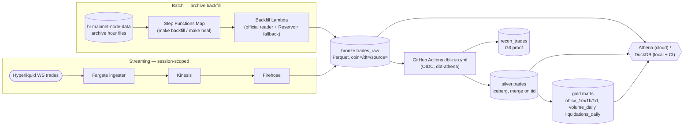

# hyperlake

Streaming lakehouse for Hyperliquid market data — live WebSocket trades + S3 archive
backfill converging into Iceberg tables on AWS serverless, reproducible in one
`terraform apply` and torn down after every demo session.

> **Status:** Phases 0–3 shipped (scaffold, batch lakehouse, streaming, convergence);
> Phase 4 (this README, demo recording, dbt docs) in progress. See
> [`docs/prd.md`](docs/prd.md) (v1.0, frozen 2026-09-05) for scope, and
> [`docs/project-plan.md`](docs/project-plan.md) for live progress.

## Architecture

Both paths write the same ingester-owned envelope into one bronze table; dbt (run from
GitHub Actions, not from AWS — [ADR-001](docs/decisions/ADR-001-dbt-runtime-github-actions.md))
is the only writer for silver and gold. Step Functions orchestrates the backfill fan-out
only — it never runs dbt.



Full component-by-component detail (what's deployed today, not just the target design)
is in [`docs/architecture/system-overview.md`](docs/architecture/system-overview.md).

## Reproduce in 15 minutes

The full path — bootstrap → apply → a real 1-day backfill → an Athena query — is
documented in [`docs/guides/bootstrap.md`](docs/guides/bootstrap.md). It's timed: a live
run on 2026-09-11 reached a queryable Athena result in **8m 53s**, comfortably inside the
G1 target. Measurement detail (per-step timings, the one gotcha hit and how the commands
below already avoid it) is recorded in
[`docs/guides/ops-runbook.md`](docs/guides/ops-runbook.md#g1-stranger-path-timing--bootstrap--backfill--athena-query-qnt-467-ac1).

```
cd infra/bootstrap && terraform init && terraform apply   # one-time per AWS account
# wire infra/main/backend.hcl from the bootstrap outputs (see the bootstrap guide)
make tf-apply-persistent
make tf-apply-ephemeral
make backfill FROM=<day> TO=<day>                         # e.g. 2026-09-10
make dbt-run ARGS="-f vars='{\"freshness_window_start\": \"<day> 00:00:00\", \"freshness_window_end\": \"<day+1> 01:00:00\"}'"
make bronze-query DT_FROM=<day>
```

## Sample queries, one per layer

Full sets: [`docs/queries/bronze.sql`](docs/queries/bronze.sql) ·
[`docs/queries/silver.sql`](docs/queries/silver.sql) ·
[`docs/queries/gold.sql`](docs/queries/gold.sql).

**Bronze** — row count for one market/day/source partition:

```sql
select count(*)
from bronze.trades_raw
where coin = 'BTC' and dt = date '2026-01-01' and source = 'ws';
```

**Silver** — exactly-once check (row count equals distinct `tid` count, proving the merge):

```sql
select count(*) as row_count, count(distinct tid) as distinct_tid
from silver.trades
where coin = 'BTC';
```

**Gold** — last 24 hourly candles for one coin:

```sql
select *
from gold.ohlcv_1h
where coin = 'BTC'
order by bucket desc
limit 24;
```

## Cost

Ephemeral by design (G4): no 24/7 compute, everything scoped to a
`session-up`/`session-down` window bounded by a dead-man's-switch reaper even if nobody
runs `session-down`. Real measured sessions from
[`costs/sessions.csv`](costs/sessions.csv); generated by `make cost-report`, full detail
(per-session table, idle-by-month, Cost Explorer reconciliation) in
[`docs/costs.md`](docs/costs.md):
<!-- COST_REPORT:START -->
| | |
|---|---|
| Average session cost | $0.32 |
| Highest session cost | $0.76 |
| Idle cost (highest month, Cost Explorer) | $-0.83/month |
| Target ceiling | < $2/session, < $2/month idle |
| Cost Explorer reconciliation gap | $-0.83 (full detail: [docs/costs.md](docs/costs.md)) |
<!-- COST_REPORT:END -->

`make cost-backfill` fills `cost_actual_usd` from Cost Explorer once its 24h tag-activation
lag clears; schema and methodology in [`costs/README.md`](costs/README.md).

## Docs map

- [PRD](docs/prd.md) — scope, goals, and the frozen v1.0 architecture decisions
- [Demo runbook](docs/demo-runbook.md) — the demo artifact: session-up → stream → heal →
  recon → query, with real measured timings and the data-quality failure sidebar
- [ADRs](docs/decisions) ([index](docs/INDEX.md#decisions-adrs)) — one per significant
  decision (dbt runtime, two-target dbt, G3 reconciliation point, Kinesis+Firehose vs.
  direct write, backfill source/trade identity)
- [System overview](docs/architecture/system-overview.md) — how it works now
- [Ops runbook](docs/guides/ops-runbook.md) — grep-first failure catalog + measured
  timings
- [Project plan](docs/project-plan.md) — phase-by-phase execution tracker

## License

[MIT](LICENSE). Hyperlake is an independent portfolio project and is not affiliated with,
endorsed by, or connected to Hyperliquid or Hyperliquid Labs.
