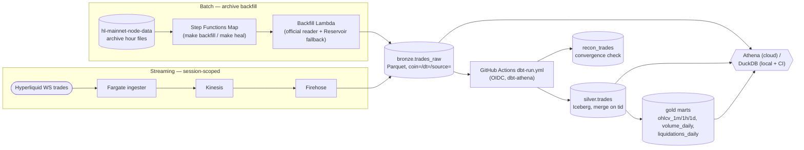

# hyperlake

[](https://github.com/noahwins-ng/hyperlake/actions/workflows/ci.yml)
[](LICENSE)
[](pyproject.toml)
[](infra)

Streaming lakehouse for Hyperliquid market data — live WebSocket trades and S3 archive
backfill converging into the same Iceberg tables on AWS serverless, reproducible from zero
with one `terraform apply` and torn down after every session.

## Why this exists

Most portfolio data pipelines run on a Kaggle CSV, and most that run in the cloud bleed money
24/7 until they rot. Hyperlake is built to avoid both. It ingests a real, high-volume feed —
Hyperliquid trades, measured at ~6.6 M/day network-wide and ~1.1 M/day on the default
5-market watchlist — through two genuinely different acquisition paths: a live WebSocket
stream and a requester-pays S3 archive. Making those two paths land in one table with
exactly-once semantics is the batch/stream convergence problem that makes lakehouse design
interesting, and proving it (not asserting it) is the project's central claim.

The second design constraint is cost. Nothing here runs 24/7: a demo session is
`terraform apply` → work → `destroy`, bounded by a dead-man's-switch reaper if nobody runs
the teardown. Measured sessions cost about $0.30; idle cost is near zero.

This is a market-data engineering project only — no trading, signals, or execution anywhere.

**Data scope.** Only the `trades` WebSocket channel — no order book, no candles feed. The
watchlist is the five markets in [`config/watchlist.yaml`](config/watchlist.yaml): BTC, ETH,
HYPE, and two HIP-3 markets by their exact exchange name, `xyz:SP500` and `xyz:XYZ100` —
together ~17 trades/s / ~1.1 M trades/day, backfilled from the official
`hl-mainnet-node-data` hourly archive. Hyperliquid trades across ~440 markets network-wide;
widening the watchlist is a one-line change to that config file, not a code change.

## Architecture

Both paths write the same ingester-owned envelope into one bronze table. dbt, run from
GitHub Actions over OIDC rather than from AWS, is the only writer for silver and gold. Step
Functions orchestrates the backfill fan-out only.



Component-by-component detail of what is deployed today is in
[`docs/architecture/system-overview.md`](docs/architecture/system-overview.md).

## Proof it works

Every number below is a real measurement recorded in the repo, cited by date and session.

- **8m 53s from `terraform apply` to a queryable Athena result** — a real 1-day backfill of
  867,681 trades, measured 2026-09-11 against the 15-minute target
  ([ops runbook](docs/guides/ops-runbook.md#g1-stranger-path-timing--bootstrap--backfill--athena-query-qnt-467-ac1)).
- **Convergence, proven by reconciliation** — a live session streamed one full clock hour,
  the same hour was backfilled from the archive, and the bronze-level set comparison came
  back `ws_only = 0`, `both = 132,823`, `backfill_only = 13,577` — all but one inside the
  session's recorded WebSocket-disconnect gap; the one residual (534 ms past the gap end) is
  documented, not hidden (2026-09-11, session `qnt-466-20260911124320`;
  [spike report](docs/spikes/2026-09-11-qnt466-g3-live-replay.md)).
- **$0.30 average session cost** over 12 finalized sessions, against a $2 ceiling — see
  [Cost](#cost).
- **dbt docs, regenerated on every push to `main`** — lineage graph bronze → silver →
  gold/recon on duckdb (offline, no AWS credentials); every silver/gold/recon column carries
  a description, proven over `manifest.json`
  ([`tests/test_dbt_docs_columns_described.py`](tests/test_dbt_docs_columns_described.py)).
  No live site — GitHub Free can't serve Pages from a private repo — so the lineage graph
  below is a static capture (`make dbt-docs && cd dbt && uv run --group dbt dbt docs serve`,
  2026-09-16):


The same coin and day traced through all three layers, from the demo session run 2026-09-12
(`qnt-468-20260912134330`, [demo runbook](docs/demo-runbook.md)):

| Layer | Query | Result |
|---|---|---|
| bronze | `make bronze-query DT_FROM=2026-09-12` | 2,197 `source='ws'` rows in 2.0 s (at-least-once: duplicates allowed) |
| silver | `select count(*), count(distinct tid) from silver.trades where …` | `row_count=2157, distinct_tid=2157` in 4.7 s (the 40 bronze duplicates resolved by the merge) |
| gold | `select * from gold.ohlcv_1m where coin='BTC' …` | `2026-09-12 13:44:00  open=77264.0  close=77261.0  volume=4.40628` in 3.2 s |

Full per-layer query sets: [`bronze.sql`](docs/queries/bronze.sql) ·
[`silver.sql`](docs/queries/silver.sql) · [`gold.sql`](docs/queries/gold.sql).

## Design decisions

One line each; the reasoning lives in the linked ADR.

- **dbt runs from GitHub Actions, not from AWS.** No always-on runtime, no container to
  host; Step Functions only fans out the backfill —
  [ADR-001](docs/decisions/ADR-001-dbt-runtime-github-actions.md).
- **Two dbt targets, one macro owning the seam.** DuckDB proves the logic offline in CI;
  the Iceberg merge is proven on Athena by a seam test on every push to `main` —
  [ADR-002](docs/decisions/ADR-002-two-target-dbt-project.md).
- **Convergence is proven at bronze, not silver.** Silver's merge keeps one row per trade,
  so only the append-only raw layer can still show which sources saw it —
  [ADR-003](docs/decisions/ADR-003-g3-reconciliation-at-bronze.md).
- **Kinesis + Firehose over a direct Fargate → S3 write.** Firehose owns buffering, Parquet
  conversion, and partitioning; the ingester stays a thin WebSocket client —
  [ADR-004](docs/decisions/ADR-004-kinesis-firehose-over-direct-write.md).
- **Official node archive as backfill source, `tid` as trade identity.** The identity gate
  passed 1,986/1,986 between feed and archive before the schema was frozen —
  [ADR-005](docs/decisions/ADR-005-backfill-source-and-trade-identity.md).
- **One Iceberg writer.** Bronze is plain Parquet; Iceberg exists only at silver/gold and is
  written exclusively by dbt-athena.
- **Event time everywhere.** Every partition and every gold window derives from exchange
  event time, never from arrival time.
- **No NAT Gateway, MWAA, MSK, OpenSearch, or QuickSight.** Each was rejected on cost;
  Fargate runs with a public IP and an egress-only security group instead.
- **No long-lived AWS keys.** GitHub Actions assumes a role over OIDC; CI runs with zero
  cloud credentials.

## Stack

| Layer | Service | Why |
|---|---|---|
| Live ingest | ECS Fargate (Python, `websockets`) | Only compute that exists during a session; no VPC plumbing of its own |
| Streaming | Kinesis Data Streams (on-demand) → Firehose | Managed buffering + Parquet conversion; ~17 trades/s never needs a shard plan |
| Batch backfill | Lambda + Step Functions Map + EventBridge | Plain-Python per archive hour; no Spark cluster to size or pay for |
| Storage | S3 — Parquet (bronze), Iceberg (silver/gold) | Hive partitions where append-only is enough; Iceberg where merge semantics are needed |
| Catalog + query | Glue Data Catalog, Athena (cloud) · DuckDB (local, CI) | Serverless per-query billing; same dbt models run offline |
| Transform + tests | dbt (`dbt-athena`, `dbt-duckdb`) | Contract, freshness, reconciliation, and OHLCV-invariant tests gate gold |
| Infrastructure | Terraform (bootstrap · persistent · ephemeral roots) | Everything tagged `project=hyperlake`; nothing hand-created |
| CI/CD | GitHub Actions, OIDC role | Offline CI on every PR; `dbt-run` and the seam test over OIDC |
| Cost guard | EventBridge Scheduler reaper, AWS Budgets | Forgotten sessions die at 6 h; Budgets is only the lagging backstop |

## Repo layout

| Path | What lives there |
|---|---|
| `src/hyperlake/` | Envelope, watchlist loader, partition helper, WebSocket ingester, backfill readers, session lifecycle, reaper, heal logic |
| `dbt/` | Models (`silver`, `gold`, `recon`, `seam`), macros, contract tests, fixtures |
| `infra/` | Terraform: `bootstrap/` (state, OIDC, budgets), `main/persistent/` (S3, Glue, Athena), `main/ephemeral/` (compute, streams) |
| `scripts/` | `session_up`/`session_down`, `heal`, `recon`, `backfill`, `bronze_query`, cost tooling, doc checks |
| `config/watchlist.yaml` | The market list; the only place markets are named |
| `sessions/` | One committed manifest per demo session: window, gaps, healed state, cost estimate |
| `costs/` | `sessions.csv` — estimate vs. next-day actual per session |
| `tests/` | pytest suite for the Python package and scripts |
| `docs/` | PRD, ADRs, architecture overview, runbooks, spikes, retros |
| `.github/workflows/` | `ci.yml`, `dbt-run.yml`, `ingester-image.yml`, `tf-drift-check.yml`, `verify-oidc.yml` |

## Run it yourself

**Prerequisites.** An AWS account with an admin-ish identity for the one-time bootstrap,
Terraform ≥ 1.9, AWS CLI v2, `uv`, and `gh`. Region is `ap-northeast-1` (both archive
buckets live there). Full walkthrough: [`docs/guides/bootstrap.md`](docs/guides/bootstrap.md).

**Run** — bootstrap once per account, then apply and backfill one day:

```
cd infra/bootstrap && terraform init && terraform apply   # one-time per AWS account
# wire infra/main/backend.hcl from the bootstrap outputs (see the bootstrap guide)
make tf-apply-persistent
make tf-apply-ephemeral
make backfill FROM=<day> TO=<day>                         # e.g. 2026-09-10
make dbt-run ARGS="-f vars='{\"freshness_window_start\": \"<day> 00:00:00\", \"freshness_window_end\": \"<day+1> 01:00:00\"}'"
```

**Verify** — bronze row count for the day, then the exactly-once check on silver:

```
make bronze-query DT_FROM=<day>
```

```sql
select count(*) as row_count, count(distinct tid) as distinct_tid
from silver.trades
where coin = 'BTC';
```

The two counts are equal. For the streaming path — `session-up` → stream → `heal` → `recon`
→ query — follow [`docs/demo-runbook.md`](docs/demo-runbook.md).

**Tear down** — the ephemeral stack is the only thing that costs money while idle:

```
make tf-destroy-ephemeral          # after a backfill; `make session-down` does this for sessions
make tf-destroy-persistent         # optional: also removes the data bucket, catalog, and workgroup
```

A one-day backfill costs on the order of $0.10; the persistent layer idles below $1/month.

## Cost

Every session's estimate is written at teardown and its actual is backfilled from Cost
Explorer the next day; both live in [`costs/sessions.csv`](costs/sessions.csv). The table
below is generated by `make cost-report`; per-session detail and the Cost Explorer
reconciliation are in [`docs/costs.md`](docs/costs.md).
<!-- COST_REPORT:START -->
| | |
|---|---|
| Average session cost | $0.30 |
| Highest session cost | $0.76 |
| Idle cost (highest month, Cost Explorer) | $-0.92/month |
| Target ceiling | < $2/session, < $2/month idle |
| Cost Explorer reconciliation gap | $-0.92 (full detail: [docs/costs.md](docs/costs.md)) |
<!-- COST_REPORT:END -->

**What this would cost you**, one scenario at a time:

| Scenario | Cost | Source |
|---|---|---|
| Idle — nothing running | ~$-0.92/month (2026-09; Cost Explorer's ~24h billing lag makes this transiently negative right after a session ends — self-corrects) | [`docs/costs.md`](docs/costs.md) idle-by-month |
| One demo session (measured: 3 min-1h25m so far) | $0.13-$0.76, avg $0.30 across 12 sessions | [`costs/sessions.csv`](costs/sessions.csv) |
| One-day backfill | negligible (<$0.01 Lambda compute; 25 invocations, 20.5s wall time) | [ops runbook, QNT-452](docs/guides/ops-runbook.md#backfill-step-functions-fan-out--measured-wall-time--cost-qnt-452) |
| 24×7 streaming, 30 days *(model, not a measurement)* | $50-$100/month | `hyperlake.session.estimate_cost_usd(720)` |

The 24×7 row is a model, not something this project ever runs — every other row above is a
real, ephemeral session. Its own line items at 720 h, from the estimator's constants:

| Line item | Cost |
|---|---|
| Fargate | $11.52 |
| Kinesis stream-hours | $34.56 |
| Kinesis + Firehose per-GB (~9.9 GB raw/month) | $1.80 |
| Athena maintenance (`iceberg-maintain`) | $0.01 |
| Overhead margin | $54.00 |
| **Model total** | **$101.89** |
| Model total, excluding the overhead margin | $47.89 |

Of the metered AWS spend (excluding the overhead margin), Kinesis's on-demand hourly charge
dominates at ~72% ($34.56 of $47.89) — it runs whether or not a trade arrives, which is
exactly why Hyperlake tears the stream down between sessions instead of leaving it up.
Receipt (2026-09-16, regenerated for this PR, not hand-typed):

```
$ uv run python -c "
from hyperlake.session import estimate_cost_usd, FARGATE_HOURLY_USD, KINESIS_HOURLY_USD, KINESIS_PER_GB_USD, FIREHOSE_INGEST_PER_GB_USD, FIREHOSE_CONVERSION_PER_GB_USD, FIREHOSE_PARTITION_PER_GB_USD, FIREHOSE_PARTITION_PER_1K_OBJECTS_USD, OVERHEAD_HOURLY_USD, BYTES_PER_SECOND, FIREHOSE_AVG_OBJECT_BYTES
h = 720; raw_gb = BYTES_PER_SECOND * h * 3600 / 1e9; objs = raw_gb * 1e9 / FIREHOSE_AVG_OBJECT_BYTES
fargate = FARGATE_HOURLY_USD * h; kinesis_hourly = KINESIS_HOURLY_USD * h
per_gb = KINESIS_PER_GB_USD * raw_gb + (FIREHOSE_INGEST_PER_GB_USD + FIREHOSE_CONVERSION_PER_GB_USD) * raw_gb + FIREHOSE_PARTITION_PER_GB_USD * raw_gb + FIREHOSE_PARTITION_PER_1K_OBJECTS_USD * (objs / 1000)
overhead = OVERHEAD_HOURLY_USD * h; total = estimate_cost_usd(h)
print(f'fargate={fargate:.2f} kinesis_stream_hours={kinesis_hourly:.2f} kinesis_firehose_per_gb={per_gb:.2f} overhead_margin={overhead:.2f} total={total} total_excl_overhead={round(total-overhead,2)}')
"
fargate=11.52 kinesis_stream_hours=34.56 kinesis_firehose_per_gb=1.80 overhead_margin=54.00 total=101.89 total_excl_overhead=47.89
```

## Testing and CI

- **Offline CI on every PR** (`make check` mirrors it exactly): ruff, pyright, pytest,
  pip-audit, `dbt build --target duckdb` (75 models and tests), `terraform fmt`/`validate`,
  and a grep that fails on any long-lived AWS key. Zero cloud credentials.
- **Athena seam test on every push to `main`**: three merge-ordering cases run against a real
  Iceberg table over OIDC, because DuckDB cannot prove `MERGE` semantics.
- **dbt contract tests gate gold**: schema, freshness, and volume tests on silver must
  pass before any gold mart builds; the convergence tests run over bronze; OHLCV
  invariants are tested on gold.
  `make dbt-demo-fail` shows a deliberate failure and the downstream skips.
- **Daily Terraform drift check** compares the Glue catalog against state and flags anything
  hand-created.
- **Docs checks**: `make docs-check` fails on any broken relative link;
  `make demo-runbook-check` fails if the runbook names a `make` target that does not exist.

## What I would do differently

- **Bronze partition projection was a cost trap.** With ~4,000 virtual partitions and no
  persisted metadata, one unbounded ad-hoc query triggers an S3 LIST per partition; that
  was most of the project's early spend. A bounded query wrapper fixed the symptom, but I
  would persist partition metadata next time.
- **Kinesis + Firehose is more machinery than ~17 trades/s needs.** The decision was made
  for the managed Parquet conversion and for learning value; a direct Parquet write from the
  ingester would be simpler at this volume.
- **Local merge parity is a real gap.** The seam test only runs on `main`, so a bad merge
  change is caught after the PR. A Trino container in CI would close it.
- **Inducing a WebSocket disconnect for the convergence proof took three attempts.** A
  gap-injection flag in the ingester would have replaced an afternoon of NACL edits.
- **Short demo sessions cannot reconcile.** The archive lands about an hour after a clock
  hour closes, so a session has to span a full clock hour and then wait for it; the demo
  should have been designed around that from the start.

## Further reading

- [PRD](docs/prd.md) — scope, goals, cost model, and the frozen decisions
- [System overview](docs/architecture/system-overview.md) — how it works now, component by component
- [Demo runbook](docs/demo-runbook.md) — the streaming path with real timings and a data-quality failure demo
- [ADR index](docs/INDEX.md#decisions-adrs) — every significant decision and its reasoning
- [Ops runbook](docs/guides/ops-runbook.md) — failure catalog and measured timings
- [Retrospectives](docs/retros) — one per completed phase, with the invariants each one added

## License

[MIT](LICENSE). Hyperlake is an independent portfolio project and is not affiliated with,
endorsed by, or connected to Hyperliquid or Hyperliquid Labs.
