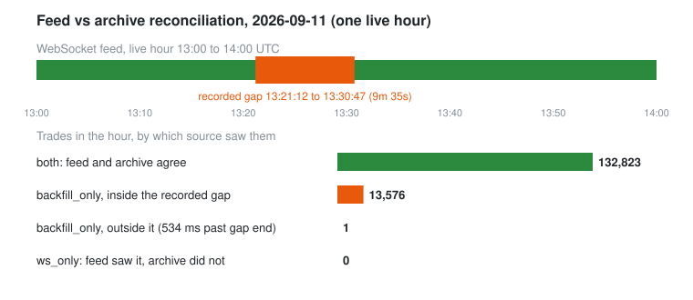
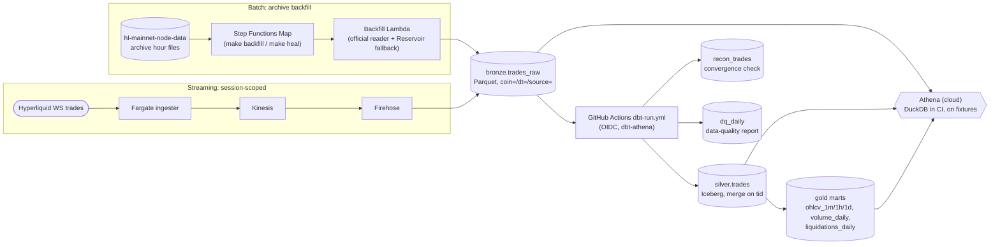

# hyperlake

[](https://github.com/noahwins-ng/hyperlake/actions/workflows/ci.yml)
[](LICENSE)
[](pyproject.toml)
[](infra)

A streaming lakehouse on AWS that combines Hyperliquid's live trade feed and its hourly
archive into one deduplicated table, and proves no trade is lost or counted twice. One
`terraform apply` builds it from zero, and it is torn down after every session.

Market data only. No trading, signals, or execution anywhere.

## Why this exists

Hyperliquid publishes the same trades twice:

- **The WebSocket feed** is live, but loses whatever happens during a disconnect.
- **The S3 archive** is complete, but lands about an hour late.
- **Hyperlake takes both**, lands them in one table, and proves nothing was lost and nothing
  counted twice. A reconciliation over the raw layer measures this after every run.



One live hour, reconciled: every trade the feed saw is in the archive (`ws_only = 0`), and
the archive-only trades sit inside the recorded disconnect, bar one 534 ms past its end
([spike report](docs/spikes/2026-09-11-qnt466-g3-live-replay.md), chart by
[`scripts/recon_chart.py`](scripts/recon_chart.py)).

The feed is real volume (about 17 trades/s across five markets). Nothing runs 24/7: a session
is `terraform apply`, work, `destroy`, with a reaper that kills forgotten sessions.

## Architecture

Data lands in three layers:

- **Bronze:** the raw, append-only record of everything either source delivered, duplicates
  included.
- **Silver:** the cleaned table with one row per trade.
- **Gold:** ready-to-query summaries such as one-minute candles and daily volume.

Together they form a lakehouse: warehouse-style tables kept as plain files in S3 and queried
in place.

dbt, run from GitHub Actions rather than from AWS, is the only writer for silver and gold.


```mermaid
flowchart LR
    subgraph batch["Batch: archive backfill"]
        ARC[("hl-mainnet-node-data<br/>archive hour files")] --> SFN["Step Functions Map<br/>(make backfill / make heal)"]
        SFN --> LAM["Backfill Lambda<br/>(official reader + Reservoir fallback)"]
    end

    subgraph live["Streaming: session-scoped"]
        WS(["Hyperliquid WS trades"]) --> FARGATE["Fargate ingester"]
        FARGATE --> KIN["Kinesis"]
        KIN --> FH["Firehose"]
    end

    LAM --> BRONZE[("bronze.trades_raw<br/>Parquet, coin=/dt=/source=")]
    FH --> BRONZE

    BRONZE --> DBT["GitHub Actions dbt-run.yml<br/>(OIDC, dbt-athena)"]
    DBT --> SILVER[("silver.trades<br/>Iceberg, merge on tid")]
    DBT --> RECON[("recon_trades<br/>convergence check")]
    SILVER --> GOLD[("gold marts<br/>ohlcv_1m/1h/1d, volume_daily,<br/>liquidations_daily")]
    DBT --> DQ[("dq_daily<br/>data-quality report")]

    BRONZE --> ATHENA{{"Athena (cloud)<br/>DuckDB in CI, on fixtures"}}
    SILVER --> ATHENA
    GOLD --> ATHENA
```

**Scope.** The `trades` channel only, for the five markets in
[`config/watchlist.yaml`](config/watchlist.yaml): BTC, ETH, HYPE, and the HIP-3 markets
`xyz:SP500` and `xyz:XYZ100`. Adding markets is a config change. Component detail:
[`docs/architecture/system-overview.md`](docs/architecture/system-overview.md).

**Stack.** ECS Fargate (Python) · Kinesis + Firehose · Lambda + Step Functions · S3 (Parquet,
Iceberg) · Glue, Athena, DuckDB · dbt · Terraform · GitHub Actions over OIDC.

## How exactly-once works

1. **Bronze is at-least-once.** The feed and the archive both append; nothing is pruned.
2. **Silver is the single Iceberg merge**, keyed on trade id `tid`. The archive row wins over
   the feed row, and `first_seen_source` records which path saw the trade first.
3. **Convergence is proven at bronze**, where both sources are still visible. `recon_trades`
   marks each trade `ws_only`, `backfill_only` or `both`; `ws_only` must be zero and every
   `backfill_only` row must fall inside a recorded WebSocket gap.
4. **Event time everywhere.** Partitions and gold windows use the exchange's timestamp, never
   arrival time.

## Proof it works

Each claim links to the query, run or report behind it.

- **Fresh account to a queryable Athena result in 8m 53s** (target 15 minutes), on a one-day
  backfill of 867,681 trades
  ([ops runbook](docs/guides/ops-runbook.md#g1-stranger-path-timing-bootstrap--backfill--athena-query-qnt-467-ac1)).
- **Nothing lost:** the live hour charted above reconciles with `ws_only = 0`
  ([spike report](docs/spikes/2026-09-11-qnt466-g3-live-replay.md)).
- **Nothing counted twice:** on 2026-09-29, bronze holds 58,926 BTC rows for 40,297 distinct
  `tid`; the 18,629 extra rows are trades both paths delivered. Silver holds exactly 40,297
  ([`bronze.sql`](docs/queries/bronze.sql) · [`silver.sql`](docs/queries/silver.sql) ·
  [`gold.sql`](docs/queries/gold.sql)).
- **Rebuildable from bronze:** a drill dropped silver and rebuilt it and all five gold marts
  from 29.5M bronze rows, with identical row counts, in 2 min 12 s for about $0.03 of Athena scan
  ([runbook](docs/guides/ops-runbook.md#rebuild-silver-and-gold-from-bronze-measured-drill-qnt-491)).
- **Quality is measured daily:** `gold.dq_daily` reports rows per source, duplicate rate,
  WebSocket gap minutes and archive lag for each coin. The archive has corrected a feed value
  0 times across three session days; a fixture test proves a correction would reach the candles.
- **$0.18 average session cost** over 13 sessions, against a $2 ceiling ([Cost](#cost)).

<details>
<summary>dbt lineage graph</summary>


</details>

Every silver, gold, recon and quality column is described, enforced by
[a pytest over `manifest.json`](tests/test_dbt_docs_columns_described.py).

## Design decisions

| Decision | Instead of | Why | ADR |
|---|---|---|---|
| dbt runs from GitHub Actions | A dbt host or MWAA | No always-on runtime | [001](docs/decisions/ADR-001-dbt-runtime-github-actions.md) |
| Two dbt targets, one macro owns the seam | One engine, or Trino in CI | DuckDB proves logic offline; Athena proves the Iceberg merge | [002](docs/decisions/ADR-002-two-target-dbt-project.md) |
| Convergence proven at bronze | Proving it at silver | Silver keeps one row per trade, so only raw shows the sources | [003](docs/decisions/ADR-003-g3-reconciliation-at-bronze.md) |
| Kinesis + Firehose | Direct Fargate to S3 | Firehose owns buffering and Parquet conversion | [004](docs/decisions/ADR-004-kinesis-firehose-over-direct-write.md) |
| Official node archive, `tid` as identity | Third-party archive as primary | Identity gate passed 1,986/1,986 before the schema froze | [005](docs/decisions/ADR-005-backfill-source-and-trade-identity.md) |

**Guardrails:**

- One Iceberg writer: only dbt-athena.
- Backfill is plain-Python Lambda, no Glue Spark.
- No NAT Gateway, MWAA, MSK, OpenSearch or QuickSight.
- No long-lived AWS keys: GitHub Actions assumes a role over OIDC, and CI runs with none.

## Not in scope at this scale

Left out on purpose, not overlooked:

- **Separate dev and prod environments.** Sessions are ephemeral and rebuilt from Terraform,
  so a second always-present environment would double idle cost for no isolation gain.
- **Lake Formation and column-level access.** The data is public market data with one reader;
  bucket and role IAM is the whole access model.
- **Capacity planning.** About 17 trades/s sits far inside on-demand Kinesis, Firehose and
  Lambda limits; nothing is provisioned to size.
- **A schema registry.** One producer owns one envelope, and upstream drift lands as nulls
  with the raw payload kept, so there is no consumer contract to negotiate.
- **Paging and alert routing.** Nothing runs 24/7, so there is no service to page for; GitHub's
  default failure emails reach the owner when a workflow fails.

## Cost

Each session's estimate is written at teardown and its actual backfilled from Cost Explorer
the next day ([`costs/sessions.csv`](costs/sessions.csv)). The table below is generated by
`make cost-report`; detail is in [`docs/costs.md`](docs/costs.md).
<!-- COST_REPORT:START -->
| | |
|---|---|
| Average session cost | $0.18 |
| Highest session cost | $0.76 |
| Idle, highest month (includes development days) | $1.39/month |
| Target ceiling | < $2/session, < $2/month idle |
<!-- COST_REPORT:END -->

Idle costs about $0.25/month in steady state; September's $1.39 is mostly development on days
with no session. A one-day backfill is under $0.01 of Lambda compute. Running the stream 24×7
would cost an estimated $50 to $100/month, mostly Kinesis's hourly charge, which is why it is
torn down between sessions ([model](costs/README.md#what-247-would-cost), never run).

## Testing and CI

- **Offline CI on every PR** (`make check` mirrors it): ruff, pyright, pytest, pip-audit,
  `dbt build --target duckdb` (every model, seed and test), `terraform validate`, and a scan for
  long-lived AWS keys. Zero cloud credentials.
- **Athena seam test** on every PR that touches `dbt/`, the seam wiring or the dependency pins,
  and on every push to `main`: three merge-ordering cases against a real Iceberg table, in a
  per-PR schema that is dropped afterwards. DuckDB cannot prove `MERGE` semantics.
- **dbt contract tests gate gold:** schema, freshness and volume checks on silver must pass
  before any gold mart builds (`make dbt-demo-fail` shows a deliberate failure).
- **Freshness target:** silver's latest event `time` is within 5 minutes of the run's window end.

## Run it yourself

**Prerequisites.** An AWS account (region `ap-northeast-1`), Terraform ≥ 1.9, AWS CLI v2, `uv`
and `gh`. Full walkthrough: [`docs/guides/bootstrap.md`](docs/guides/bootstrap.md).

```
cd infra/bootstrap && terraform init && terraform apply   # one-time per AWS account
# wire infra/main/backend.hcl from the bootstrap outputs (see the bootstrap guide)
make tf-apply-persistent
make tf-apply-ephemeral
make backfill FROM=<day> TO=<day>                         # e.g. 2026-09-10
make dbt-run-day DAY=<day>                                # builds silver/gold for that day
```

**Verify.** `make bronze-query DT_FROM=<day>` for the day's bronze rows, then the exactly-once
check in [`silver.sql`](docs/queries/silver.sql): row count equals distinct `tid` count. The
streaming path (`session-up` → stream → `heal` → `recon`) is in
[`docs/demo-runbook.md`](docs/demo-runbook.md).

**Tear down.** `make tf-destroy-ephemeral` after a backfill (`make session-down` does this for
sessions); `make tf-destroy-persistent` also removes the data bucket, catalog and workgroup.

## Lessons learned

- **Bronze partition projection was a cost trap.** One unbounded query triggers an S3 LIST per
  virtual partition. A bounded query wrapper fixed the symptom; persisted metadata is the fix.
- **Kinesis + Firehose is more machinery than ~17 trades/s needs.** A direct Parquet write
  would be simpler at this volume.
- **The seam test first ran only on `main`**, so a bad merge was caught after the PR. It now
  runs per PR in its own schema.
- **Inducing a WebSocket disconnect took three attempts.** The ingester now has a
  gap-injection flag.
- **Short demo sessions cannot reconcile.** The archive lands about an hour after a clock hour
  closes, so a demo should span one from the start.

## Repo layout and further reading

`src/hyperlake/` ingester, backfill readers, session lifecycle · `dbt/` models, macros, tests ·
`infra/` Terraform (bootstrap, persistent, ephemeral) · `scripts/` session, heal, recon and
cost tooling · `docs/` PRD, ADRs, runbooks, spikes.

[PRD](docs/prd.md) · [System overview](docs/architecture/system-overview.md) ·
[Demo runbook](docs/demo-runbook.md) · [ADR index](docs/INDEX.md#decisions-adrs)

## License

[MIT](LICENSE). Hyperlake is an independent portfolio project and is not affiliated with,
endorsed by, or connected to Hyperliquid or Hyperliquid Labs.
