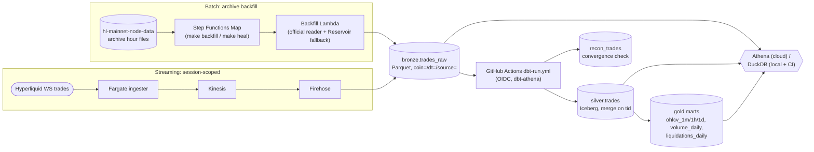

# hyperlake

[](https://github.com/noahwins-ng/hyperlake/actions/workflows/ci.yml)
[](LICENSE)
[](pyproject.toml)
[](infra)

Streaming lakehouse for Hyperliquid market data: live WebSocket trades and S3 archive
backfill converging into the same Iceberg tables on AWS serverless, reproducible from zero
with one `terraform apply` and torn down after every session.

| Claim | Measured | Evidence |
|---|---|---|
| Reproducible by a stranger | 8m 53s from `terraform apply` to a queryable Athena result | [Proof](#proof-it-works) |
| Nothing lost, nothing double-counted | `ws_only = 0` on a live-vs-archive reconciliation | [How exactly-once works](#how-exactly-once-works) |
| Near-zero cost | $0.14 average session, about $0.25/month idle | [Cost](#cost) |
| Tested without a cloud account | 76 dbt models, seeds and tests plus pytest, zero AWS credentials in CI | [Testing and CI](#testing-and-ci) |

Market data only. No trading, signals, or execution anywhere.

## Why this exists

Hyperliquid publishes the same trades twice. A WebSocket feed delivers them live but loses
whatever happens during a disconnect; an S3 archive delivers them complete but about an hour
late. A system that wants both freshness and completeness has to take both, land them in
one table, and show that nothing was lost and nothing was counted twice.

The proof is the point. A reconciliation over the raw layer names every trade one path saw
and the other did not, so exactly-once is measured after every run rather than assumed from
the design. The feed is real volume, about 17 trades/s across five markets, enough that the
storage and merge choices matter. The second constraint is cost: nothing runs 24/7. A session
is `terraform apply`, work, `destroy`, with a dead-man's-switch reaper if the teardown is
forgotten.

## Architecture

Both paths write the same ingester-owned envelope into one bronze table. dbt, run from
GitHub Actions over OIDC rather than from AWS, is the only writer for silver and gold. Step
Functions orchestrates the backfill fan-out only.


```mermaid
flowchart LR
    subgraph batch["Batch: archive backfill"]
        ARC[("hl-mainnet-node-data<br/>archive hour files")] --> SFN["Step Functions Map<br/>(make backfill / make heal)"]
        SFN --> LAM["Backfill Lambda<br/>(official reader + Reservoir fallback)"]
    end

    subgraph live["Streaming: session-scoped"]
        WS(["Hyperliquid WS trades"]) --> FARGATE["Fargate ingester"]
        FARGATE --> KIN["Kinesis"]
        KIN --> FH["Firehose"]
    end

    LAM --> BRONZE[("bronze.trades_raw<br/>Parquet, coin=/dt=/source=")]
    FH --> BRONZE

    BRONZE --> DBT["GitHub Actions dbt-run.yml<br/>(OIDC, dbt-athena)"]
    DBT --> SILVER[("silver.trades<br/>Iceberg, merge on tid")]
    DBT --> RECON[("recon_trades<br/>convergence check")]
    SILVER --> GOLD[("gold marts<br/>ohlcv_1m/1h/1d, volume_daily,<br/>liquidations_daily")]

    BRONZE --> ATHENA{{"Athena (cloud) /<br/>DuckDB (local + CI)"}}
    SILVER --> ATHENA
    GOLD --> ATHENA
```

**Data scope.** The `trades` WebSocket channel only (no order book, no candles), for the five
markets in [`config/watchlist.yaml`](config/watchlist.yaml): BTC, ETH, HYPE, and the HIP-3
markets `xyz:SP500` and `xyz:XYZ100`. Backfill reads the official `hl-mainnet-node-data`
hourly archive. Widening to more of Hyperliquid's ~440 markets is a config change, not a code
change. Component detail is in
[`docs/architecture/system-overview.md`](docs/architecture/system-overview.md).

## How exactly-once works

1. **Bronze is append-only plain Parquet** and at-least-once: the live feed and the archive
   both write, duplicates allowed, nothing is ever pruned for a window under reconciliation.
2. **Silver is the single Iceberg merge**, keyed on the trade id `tid`. The archive row
   outranks the feed row on update, and `first_seen_source` records which path saw it first.
3. **Convergence is proven at bronze, not silver**, because silver keeps one row per trade and
   so cannot show which sources saw it. `recon_trades` classifies every trade as `ws_only`,
   `backfill_only` or `both`; any `backfill_only` row must fall inside a recorded WebSocket
   gap, and `ws_only` must be zero.
4. **Event time everywhere.** Partitions and every gold window derive from the exchange's
   event time, never arrival time, so a late archive row lands in the right day.

## Proof it works

Every number below is a real measurement recorded in the repo, cited by date and session.

- **8m 53s from `terraform apply` to a queryable Athena result.** A real 1-day backfill of
  867,681 trades, measured 2026-09-11 against the 15-minute target
  ([ops runbook](docs/guides/ops-runbook.md#g1-stranger-path-timing-bootstrap--backfill--athena-query-qnt-467-ac1)).
- **Convergence, proven by reconciliation.** A live session streamed one full clock hour,
  the same hour was backfilled from the archive, and the bronze-level set comparison came
  back `ws_only = 0`, `both = 132,823`, `backfill_only = 13,577`, all but one inside the
  session's recorded WebSocket-disconnect gap; the one residual (534 ms past the gap end) is
  documented, not hidden (2026-09-11, session `qnt-466-20260911124320`;
  [spike report](docs/spikes/2026-09-11-qnt466-g3-live-replay.md)).
- **$0.14 average session cost** over 12 finalized sessions, against a $2 ceiling. See
  [Cost](#cost).
- **dbt docs regenerated on every push to `main`**, offline on DuckDB; every silver/gold/recon
  column is described, enforced by
  [a pytest over `manifest.json`](tests/test_dbt_docs_columns_described.py). Lineage as of
  2026-09-16:


The same coin and day traced through all three layers, from the demo session run 2026-09-12
(`qnt-468-20260912134330`, [demo runbook](docs/demo-runbook.md)):

| Layer | Query | Result |
|---|---|---|
| bronze | `make bronze-query DT_FROM=2026-09-12` | 2,197 `source='ws'` rows in 2.0 s (at-least-once: duplicates allowed) |
| silver | `select count(*), count(distinct tid) from silver.trades where …` | `row_count=2157, distinct_tid=2157` in 4.7 s (the 40 bronze duplicates resolved by the merge) |
| gold | `select * from gold.ohlcv_1m where coin='BTC' …` | `2026-09-12 13:44:00  open=77264.0  close=77261.0  volume=4.40628` in 3.2 s |

Full per-layer query sets: [`bronze.sql`](docs/queries/bronze.sql) ·
[`silver.sql`](docs/queries/silver.sql) · [`gold.sql`](docs/queries/gold.sql).

## Design decisions

Each row names what was rejected; the reasoning lives in the linked ADR.

| Decision | Instead of | Why | ADR |
|---|---|---|---|
| dbt runs from GitHub Actions | A dbt host or MWAA in AWS | No always-on runtime; Step Functions only fans out the backfill | [001](docs/decisions/ADR-001-dbt-runtime-github-actions.md) |
| Two dbt targets, one macro owns the seam | One engine, or a Trino container in CI | DuckDB proves logic offline; the real Iceberg merge is proven on Athena by the seam test | [002](docs/decisions/ADR-002-two-target-dbt-project.md) |
| Convergence proven at bronze | Proving it at silver | Silver keeps one row per trade, so only the raw layer shows which sources saw it | [003](docs/decisions/ADR-003-g3-reconciliation-at-bronze.md) |
| Kinesis + Firehose | Direct Fargate to S3 | Firehose owns buffering, Parquet conversion and partitioning; the ingester stays thin | [004](docs/decisions/ADR-004-kinesis-firehose-over-direct-write.md) |
| Official node archive, `tid` as identity | Third-party archive as primary | The identity gate passed 1,986/1,986 between feed and archive before the schema froze | [005](docs/decisions/ADR-005-backfill-source-and-trade-identity.md) |

**Guardrails.** One Iceberg writer (bronze is plain Parquet; only dbt-athena writes Iceberg).
Backfill is plain-Python Lambda, no Glue Spark. No NAT Gateway, MWAA, MSK, OpenSearch, or
QuickSight; Fargate runs with a public IP and an egress-only security group. No long-lived
AWS keys; GitHub Actions assumes a role over OIDC, and CI runs with none.

## Stack

| Layer | Service | Why |
|---|---|---|
| Live ingest | ECS Fargate (Python, `websockets`) | Only compute that exists during a session; no VPC plumbing of its own |
| Streaming | Kinesis Data Streams (on-demand) → Firehose | Managed buffering + Parquet conversion; ~17 trades/s never needs a shard plan |
| Batch backfill | Lambda + Step Functions Map + EventBridge | Plain-Python per archive hour; no Spark cluster to size or pay for |
| Storage | S3: Parquet (bronze), Iceberg (silver/gold) | Hive partitions where append-only is enough; Iceberg where merge semantics are needed |
| Catalog + query | Glue Data Catalog, Athena (cloud) · DuckDB (local, CI) | Serverless per-query billing; same dbt models run offline |
| Transform + tests | dbt (`dbt-athena`, `dbt-duckdb`) | Contract, freshness, reconciliation, and OHLCV-invariant tests gate gold |
| Infrastructure | Terraform (bootstrap · persistent · ephemeral roots) | Everything tagged `project=hyperlake`; nothing hand-created |
| CI/CD | GitHub Actions, OIDC role | Offline CI on every PR; `dbt-run` and the seam test over OIDC |
| Cost guard | EventBridge Scheduler reaper, AWS Budgets | Forgotten sessions die at 6 h; Budgets is only the lagging backstop |

## Cost

Every session's estimate is written at teardown and its actual is backfilled from Cost
Explorer the next day; both live in [`costs/sessions.csv`](costs/sessions.csv). The table
below is generated by `make cost-report`; per-session detail and the Cost Explorer
reconciliation are in [`docs/costs.md`](docs/costs.md).
<!-- COST_REPORT:START -->
| | |
|---|---|
| Average session cost | $0.14 |
| Highest session cost | $0.76 |
| Idle cost (highest month, Cost Explorer) | $1.16/month |
| Target ceiling | < $2/session, < $2/month idle |
| Cost Explorer reconciliation gap | $1.16 (full detail: [docs/costs.md](docs/costs.md)) |
<!-- COST_REPORT:END -->

**What this would cost you:**

| Scenario | Cost | Source |
|---|---|---|
| Idle, nothing running | about $0.25/month steady state (September's $1.16 is mostly development on days with no session) | [`docs/costs.md`](docs/costs.md) |
| One demo session | $0.02–$0.76, avg $0.14 across 12 sessions (each day's cost split across that day's sessions by duration) | [`costs/sessions.csv`](costs/sessions.csv) |
| One-day backfill | under $0.01 of Lambda compute | [ops runbook](docs/guides/ops-runbook.md#backfill-step-functions-fan-out-measured-wall-time--cost-qnt-452) |
| 24×7 streaming, 30 days *(model, never run)* | $50–$100/month | [`costs/README.md`](costs/README.md#what-247-would-cost) |

In the 24×7 model, Kinesis's on-demand hourly charge is ~72% of metered spend and accrues
whether or not a trade arrives, which is exactly why the stream is torn down between sessions.

## Testing and CI

- **Offline CI on every PR** (`make check` mirrors it exactly): ruff, pyright, pytest,
  pip-audit, `dbt build --target duckdb` (76 models, seeds and tests), `terraform fmt`/`validate`,
  and a grep that fails on any long-lived AWS key. Zero cloud credentials.
- **Athena seam test on every PR that touches `dbt/`, the seam wiring or the dependency
  pins, and on every push to `main`**: three merge-ordering cases run against a real Iceberg
  table over OIDC, in a per-PR schema that is dropped afterwards, because DuckDB cannot prove
  `MERGE` semantics.
- **dbt contract tests gate gold**: schema, freshness, and volume tests on silver must pass
  before any gold mart builds; convergence tests run over bronze; OHLCV invariants on gold.
  `make dbt-demo-fail` shows a deliberate failure and the downstream skips.
- **Daily Terraform drift check** flags anything in the Glue catalog that Terraform did not create.
- **Docs checks**: `make docs-check` fails on any broken relative link;
  `make demo-runbook-check` fails if the runbook names a `make` target that does not exist.

## Run it yourself

**Prerequisites.** An AWS account with an admin-ish identity for the one-time bootstrap,
Terraform ≥ 1.9, AWS CLI v2, `uv` (Terraform itself shells out to it for the Glue schema), and
`gh`. Region is `ap-northeast-1` (both archive buckets live there). Full walkthrough: [`docs/guides/bootstrap.md`](docs/guides/bootstrap.md).

**Run.** Bootstrap once per account, then apply and backfill one day:

```
cd infra/bootstrap && terraform init && terraform apply   # one-time per AWS account
# wire infra/main/backend.hcl from the bootstrap outputs (see the bootstrap guide)
make tf-apply-persistent
make tf-apply-ephemeral
make backfill FROM=<day> TO=<day>                         # e.g. 2026-09-10; <N> below = days from <day> to today, plus 1
make dbt-run ARGS="-f vars='{\"silver_lookback_days\": <N>, \"freshness_window_start\": \"<day> 00:00:00\", \"freshness_window_end\": \"<day+1> 01:00:00\"}'"
```

**Verify.** `make bronze-query DT_FROM=<day>` for the day's bronze rows, then the
exactly-once check from [`silver.sql`](docs/queries/silver.sql): row count equals distinct
`tid` count. For the streaming path (`session-up` → stream → `heal` → `recon` → query)
follow [`docs/demo-runbook.md`](docs/demo-runbook.md).

**Tear down.** The ephemeral stack is the only thing that costs money while idle:

```
make tf-destroy-ephemeral          # after a backfill; `make session-down` does this for sessions
make tf-destroy-persistent         # optional: also removes the data bucket, catalog, and workgroup
```

A one-day backfill costs on the order of $0.10; the persistent layer idles below $1/month.

## What I would do differently

- **Bronze partition projection was a cost trap.** ~4,000 virtual partitions and no persisted
  metadata means one unbounded query triggers an S3 LIST per partition; that was most of the
  early spend. A bounded query wrapper fixed the symptom; persisted metadata is the real fix.
- **Kinesis + Firehose is more machinery than ~17 trades/s needs.** Chosen for managed
  Parquet conversion and learning value; a direct Parquet write would be simpler at this volume.
- **The seam test first ran only on `main`**, so a bad merge change was caught after the PR.
  It now runs per PR in its own schema; a Trino container would have tested a different `MERGE`.
- **Inducing a WebSocket disconnect took three attempts.** A gap-injection flag in the
  ingester would have replaced an afternoon of NACL edits; it now has one.
- **Short demo sessions cannot reconcile.** The archive lands ~1 h after a clock hour closes,
  so the demo should have been designed around a session that spans one from the start.

## Repo layout and further reading

| Path | What lives there |
|---|---|
| `src/hyperlake/` | Envelope, watchlist loader, partition helper, WebSocket ingester, backfill readers, session lifecycle, reaper, heal logic |
| `dbt/` | Models (`silver`, `gold`, `recon`, `seam`), macros, contract tests, fixtures |
| `infra/` | Terraform: `bootstrap/` (state, OIDC, budgets), `main/persistent/` (S3, Glue, Athena), `main/ephemeral/` (compute, streams) |
| `scripts/` | `session_up`/`session_down`, `heal`, `recon`, `backfill`, `bronze_query`, cost tooling, doc checks |
| `config/watchlist.yaml` | The market list; the only place markets are named |
| `sessions/` · `costs/` | One committed manifest per demo session; `sessions.csv` with estimate vs. next-day actual |
| `.github/workflows/` | `ci.yml`, `dbt-run.yml`, `seam-pr.yml`, `ingester-image.yml`, `tf-drift-check.yml`, `verify-oidc.yml` |

[PRD](docs/prd.md) (scope, goals, cost model, frozen decisions) ·
[System overview](docs/architecture/system-overview.md) ·
[Demo runbook](docs/demo-runbook.md) ·
[ADR index](docs/INDEX.md#decisions-adrs)

## License

[MIT](LICENSE). Hyperlake is an independent portfolio project and is not affiliated with,
endorsed by, or connected to Hyperliquid or Hyperliquid Labs.
